<div align="center">

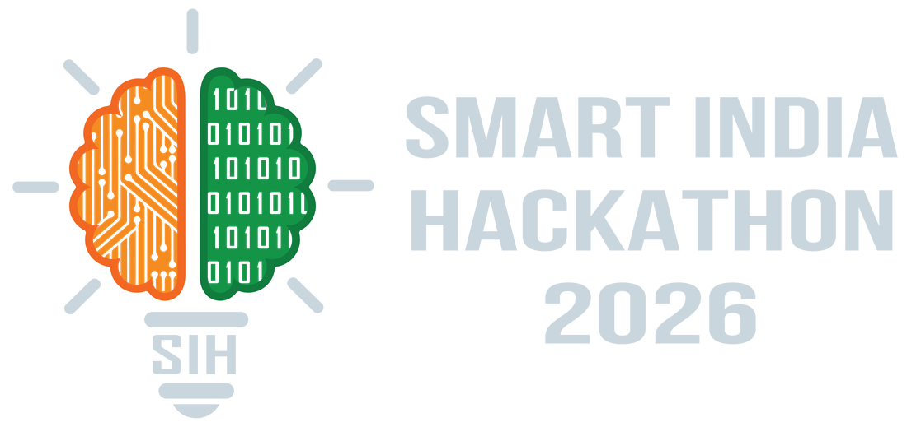

<br>

# AyushCare MediKiosk

**AI-assisted multilingual patient intake and clinical handoff**<br>
*From registration and triage to documents, vitals, queueing, and physician review*

<br>

[](AyushCareKiosk/)
[](AyushCareAI/)
[](AyushCareBackend/)
[](AyushCareMobile/)
[](HNDPANEL/)

</div>

<br>

> **A better first five minutes of care.** AyushCare turns a patient’s arrival into a structured,
> multilingual clinical intake that can be reviewed by the right doctor with less repetition and
> less paperwork.

AyushCare is a connected healthcare platform for hospitals and clinics. A patient can begin at a
physical kiosk, continue on a phone through a QR handoff, and arrive in a doctor workspace with
structured history, vitals, documents, consent, risk signals, and queue context.

## At a glance

| Patient experience | Clinical intelligence | Hospital operations |
| --- | --- | --- |
| Multilingual kiosk intake, voice and touch interaction, mobile continuity, and patient-controlled privacy | Adaptive interview, document extraction, red-flag detection, vitals, and clinician-reviewed summaries | Department routing, doctor assignment, OPD tokens, queue visibility, rosters, rooms, and consultation sign-off |

AyushCare is built around one connected handoff: **the patient tells their story once, the system
organizes it responsibly, and the care team starts with context.**

## Contents

- [Why it matters](#why-it-matters)
- [What it does](#what-it-does)
- [Patient journey](#patient-journey)
- [System architecture](#system-architecture)
- [AI and clinical safety](#ai-and-clinical-safety)
- [Product surfaces](#product-surfaces)
- [Demonstration flow](#demonstration-flow)
- [Repository structure](#repository-structure)
- [Technology stack](#technology-stack)
- [Current implementation status](#current-implementation-status)
- [Run locally](#run-locally)
- [Documentation](#documentation)

<br>

## Why it matters

The front desk is often where clinical information gets fragmented. Patients repeat the same story,
reports stay in paper folders, and doctors spend valuable consultation time reconstructing context.
AyushCare moves that work earlier in the journey while keeping clinical decisions with the physician.

| Before the consultation | AyushCare workflow |
| --- | --- |
| Repeated registration questions | Guided, stateful patient intake |
| Paper prescriptions and reports | QR-assisted phone upload and document processing |
| Unstructured patient history | AI-assisted clinical summary with source context |
| Unclear department routing | Department, pathway, doctor, and token flow |
| Language and accessibility barriers | Multilingual UI plus voice input and narration |
| Uncontrolled record sharing | Granular consent and patient privacy controls |

## What it does

- **Guided patient intake** — identity, consent, language, department, pathway, symptoms, and history.
- **AI clinical interview** — adaptive SOCRATES-style questioning with text and speech input.
- **Safety-first triage** — deterministic red-flag rules, compound pattern detection, and escalation signals.
- **Document intelligence** — upload prescriptions, laboratory reports, and medical documents for OCR and structured extraction.
- **Clinical summary generation** — physician-ready sections with patient-reported and document-derived context.
- **Vitals and queue management** — kiosk measurements, OPD tokens, consultation status, and doctor assignment.
- **QR continuity** — pair a kiosk session with a mobile portal so patients can upload documents from their own phone.
- **Privacy and consent** — DPDPA-oriented consent receipts, privacy settings, scoped sharing rules, and audit events.
- **Clinician workspace** — doctor queue, patient summary, reports, vitals, notes, and consultation sign-off.

## Patient journey

```mermaid
flowchart LR
  A[Patient arrives] --> B[Choose language]
  B --> C[Identity and consent]
  C --> D[Department and doctor routing]
  D --> E[AI clinical interview]
  E --> F[Vitals and red-flag checks]
  F --> G[Upload documents by QR]
  G --> H[Generate clinical summary]
  H --> I[Token and queue]
  I --> J[Doctor review and sign-off]
```

## System architecture

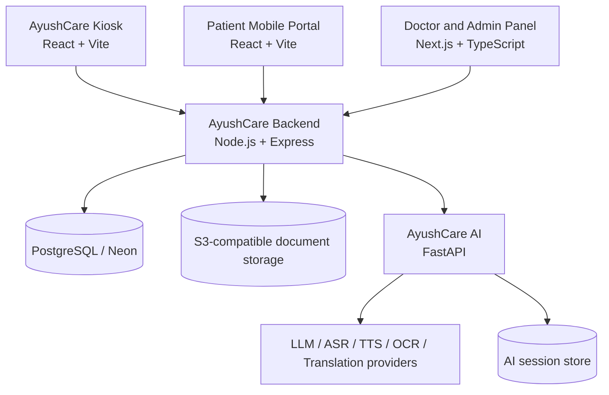

The core API owns identity, consultations, routing, queue state, document registration, consent,
privacy, and portal access. The Python service owns the clinical conversation, document intelligence,
summary generation, safety checks, and FHIR preview. Frontends remain presentation and workflow clients.

## AI and clinical safety

The AI layer is assistive by design. It does **not** diagnose, prescribe, or replace clinical judgement.

| Capability | Implementation |
| --- | --- |
| Clinical interview | Adaptive history collection following SOCRATES-style questioning |
| Speech | Server-side ASR and TTS integration with multilingual support |
| Document processing | OCR, medical entity extraction, abnormal-value flagging, and image quality checks |
| Safety | Deterministic red-flag rules plus LLM-assisted compound pattern detection |
| Summary | Structured clinical summary with clinician accept, reject, and edit workflow |
| Interoperability | FHIR R4 bundle preview |
| Governance | Consent receipts, audit logging, privacy settings, and scoped access rules |

## Product surfaces

### 1. AyushCare Kiosk

<table>
  <tr>
    <td align="center">
      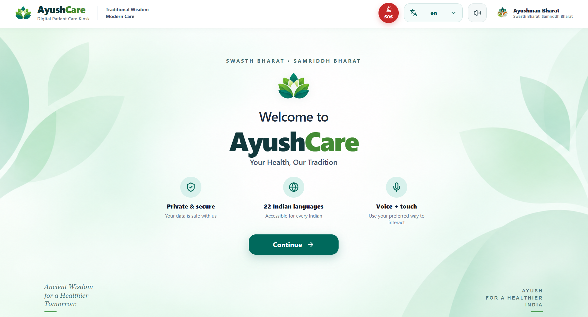
      <br><sub>Welcome, language, and accessible intake start</sub>
    </td>
    <td align="center">
      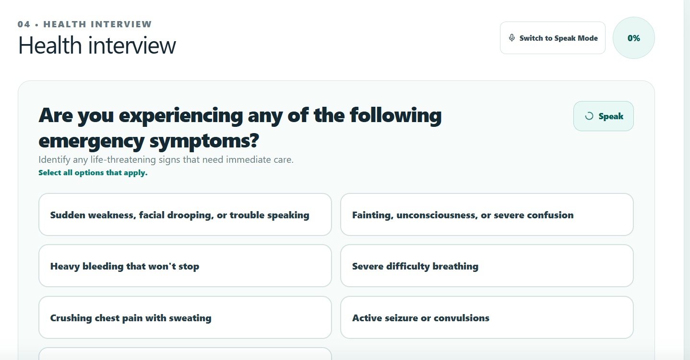
      <br><sub>Emergency symptom screening and guided interview</sub>
    </td>
    <td align="center">
      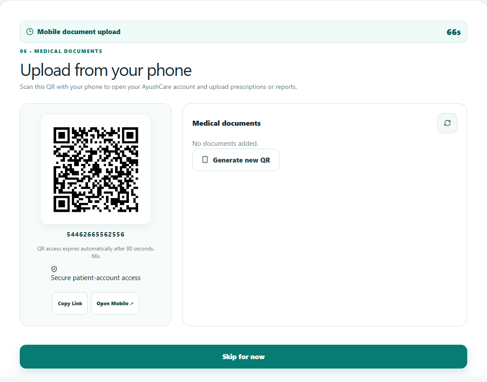
      <br><sub>QR handoff for mobile document upload</sub>
    </td>
  </tr>
</table>

The kiosk combines language selection, privacy messaging, voice and touch interaction, emergency
screening, guided responses, and a secure QR handoff for prescriptions and reports.

### 2. AyushCare Mobile

<table>
  <tr>
    <td align="center">
      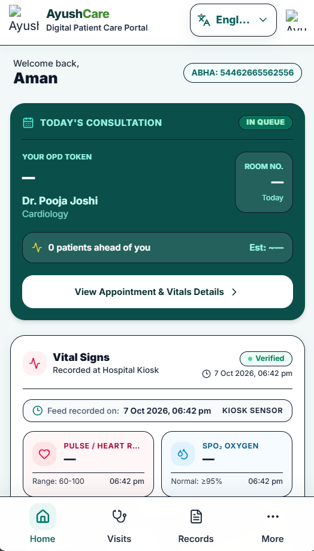
      <br><sub>Home and verified vitals</sub>
    </td>
    <td align="center">
      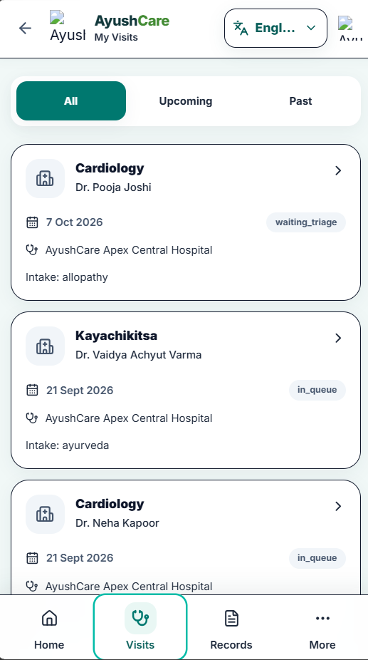
      <br><sub>Visits and appointments</sub>
    </td>
    <td align="center">
      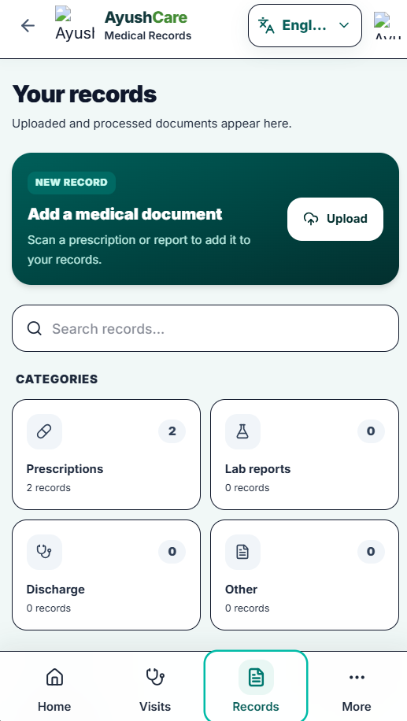
      <br><sub>Medical records</sub>
    </td>
    <td align="center">
      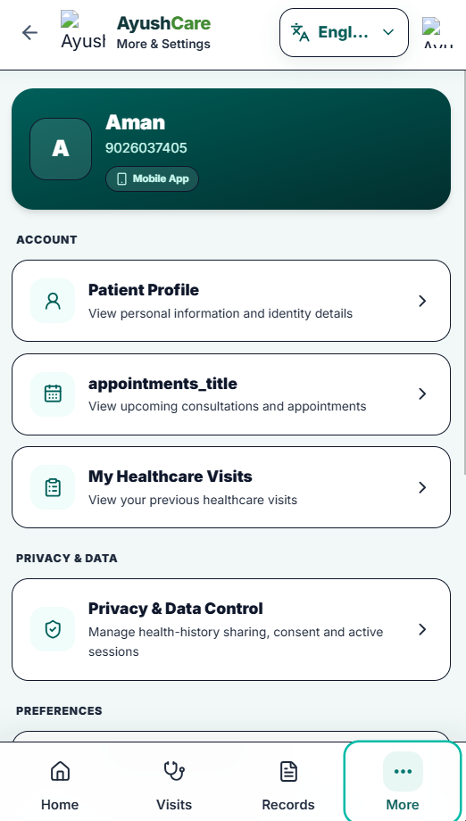
      <br><sub>Privacy and settings</sub>
    </td>
  </tr>
</table>

The mobile portal carries the patient beyond the kiosk: active consultation status, queue context,
visits, records, appointments, profile details, and privacy controls remain available from one place.

### 3. AyushCare Doctor and Admin Panel

<table>
  <tr>
    <td align="center">
      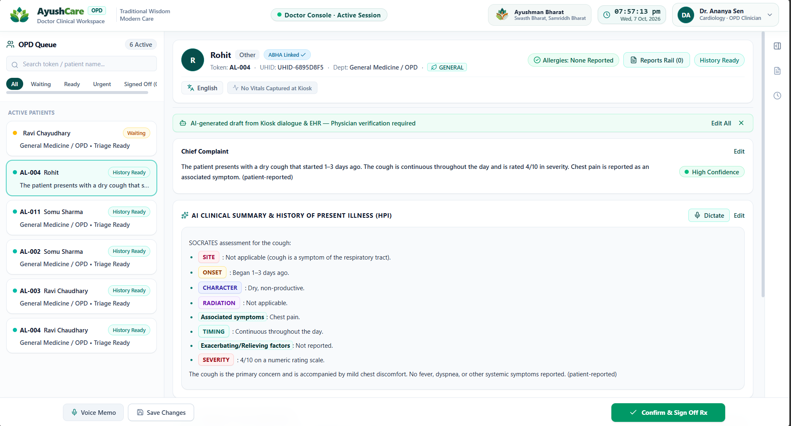
      <br><sub>Doctor clinical workspace: queue, AI summary, evidence, editing, and sign-off</sub>
    </td>
    <td align="center">
      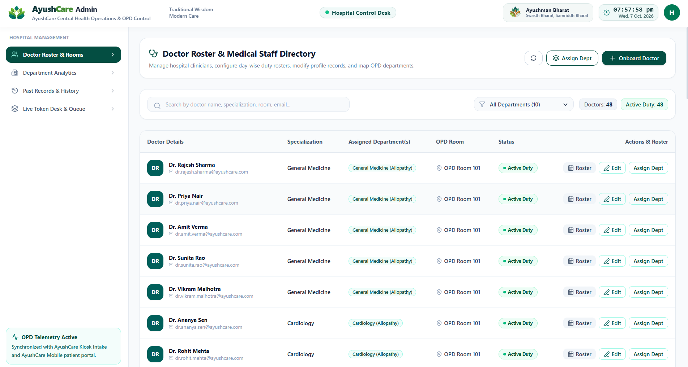
      <br><sub>Admin control desk: rosters, departments, rooms, schedules, and duty status</sub>
    </td>
  </tr>
</table>

The doctor and admin surfaces turn the intake record into coordinated action: clinicians verify the
AI-assisted history, while hospital teams manage the people, departments, rooms, and queues behind care delivery.

The screenshot set is stored in [docs/screenshots](docs/screenshots) and represents the implemented
workflows across all three AyushCare surfaces: patient kiosk, patient mobile portal, and doctor/admin
operations.

## What makes the workflow different

1. **Patient-first capture** — the kiosk is designed around language choice, accessibility, voice, touch, and guided questions.
2. **Structured before intelligent** — answers, vitals, documents, and consent become usable records before AI adds interpretation.
3. **Human verification stays visible** — AI summaries carry confidence and source context, with editing and sign-off built into the doctor workflow.
4. **Continuity across devices** — QR pairing lets the patient move from a public kiosk to their private phone without restarting the journey.
5. **Operations are part of care** — routing, OPD tokens, rosters, rooms, and queue states connect intake to the consultation itself.

## Demonstration flow

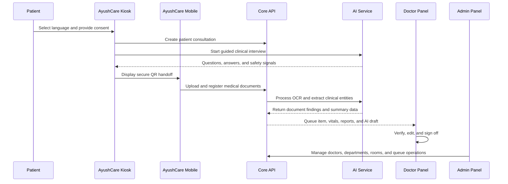

## Repository structure

```text
Medikiosk/
├── AyushCareAI/              # FastAPI clinical AI service and tests
├── AyushCareBackend/         # Express API, PostgreSQL access, auth, queue, QR, and storage
├── AyushCareKiosk/           # React/Vite patient kiosk experience
├── AyushCareMobile/          # React/Vite mobile portal and document flow
├── HNDPANEL/                 # Next.js doctor and hospital admin panel
├── docs/screenshots/         # Product walkthrough screenshots
├── MEDIKIOSK_CURRENT_STATE_AUDIT.md
└── MEDIKIOSK_CURRENT_STATE_AUDIT.json
```

## Service map

| Service | Responsibility | Default port |
| --- | --- | ---: |
| `AyushCareKiosk` | Patient check-in, intake, consent, interview, vitals, QR handoff | `5173` |
| `AyushCareMobile` | Patient portal, documents, visits, records, and privacy | `5174` |
| `AyushCareBackend` | Auth, consultations, routing, queue, QR sessions, storage, and APIs | `8000` |
| `AyushCareAI` | Conversation, speech, OCR, extraction, safety, summaries, and FHIR preview | `8001` |
| `HNDPANEL` | Doctor clinical workspace and hospital administration | `3000` |

## Core data model

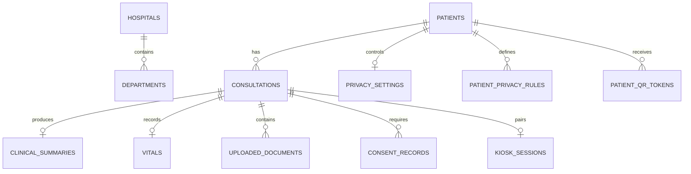

The backend uses PostgreSQL with UUID-based internal identities and unique ABHA identifiers. The AI
service has its own session and audit persistence boundary, with Redis support and an in-memory fallback
for development. Documents are stored through an S3-compatible object-storage integration.

## Technology stack

| Layer | Technology |
| --- | --- |
| Patient kiosk | React, Vite, Zustand, Axios, Lucide |
| Mobile portal | React, Vite, React Router, React Hook Form, Zod, Zustand |
| Doctor/admin panel | Next.js App Router, React, TypeScript, Tailwind CSS |
| Core backend | Node.js, Express, PostgreSQL, JWT, AWS S3 SDK |
| AI service | Python, FastAPI, Pydantic, SQLAlchemy, Redis |
| AI integrations | Gemini, Groq, Bhashini, Azure Document Intelligence, Azure Language, Tesseract |
| Testing | Pytest safety and service suites, frontend lint/build scripts |

## Current implementation status

The repository contains an end-to-end working prototype spanning five applications:

- 10 kiosk screens and a multilingual patient intake flow.
- 23 mobile/portal screens covering home, visits, appointments, records, privacy, and QR connection.
- Doctor queue and clinical workspace with summary, reports, vitals, and sign-off paths.
- AI tests covering conversation, clinical summaries, document intelligence, FHIR, red flags, and safety.
- Backend routes for auth, intake, mobile portal, language, documents, consent, privacy, routing, and queueing.

Some infrastructure capabilities remain environment-dependent. For example, production credentials,
PostgreSQL, object storage, provider APIs, and SMS configuration must be supplied separately. The audit
file is the source of truth for the current implementation boundaries and known gaps.

## Verification checklist

Use these checks before a demo or integration handoff:

```bash
# AI service tests
cd AyushCareAI
pytest tests/ -v

# Frontend checks
cd ../AyushCareKiosk
npm run lint
npm run build

cd ../AyushCareMobile
npm run lint
npm run build

cd ../HNDPANEL
npm run lint
npm run build
```

For a complete demo, start the AI service and core backend first, then launch the kiosk, mobile portal,
and doctor/admin panel. Confirm that the frontend API URLs and server-side provider credentials match the
local environment before testing a live patient flow.

## Run locally

### Prerequisites

- Python 3.10+
- Node.js and npm
- PostgreSQL for the core backend
- Redis is recommended for the AI service
- Provider credentials configured in server-side `.env` files

### Start the AI service

```bash
cd AyushCareAI
python -m venv .venv
.venv\Scripts\activate        # Windows
pip install -r requirements.txt
uvicorn app.main:app --reload --port 8001
```

Run the AI tests:

```bash
pytest tests/ -v
```

### Start the core backend

```bash
cd AyushCareBackend
npm install
npm run dev                    # port 8000
```

### Start the patient applications

```bash
cd AyushCareKiosk
npm install
npm run dev                    # Vite, normally port 5173
```

```bash
cd AyushCareMobile
npm install
npm run dev                    # Vite, normally port 5174
```

### Start the doctor/admin panel

```bash
cd HNDPANEL
npm install
npm run dev                    # Next.js, normally port 3000
```

Each service should be configured with the API URL expected by its local environment. Keep database,
AI, storage, SMS, and authentication secrets on the server and never commit `.env` files.

## Documentation

- [Current state audit](MEDIKIOSK_CURRENT_STATE_AUDIT.md) — architecture, routes, database, privacy, and integration findings.
- [AI service README](AyushCareAI/README.md) — AI endpoints, providers, safety modules, and test commands.
- [Backend README](AyushCareBackend/README.md) — core API setup and integration notes.
- [Kiosk README](AyushCareKiosk/README.md) — kiosk workflow and frontend setup.
- [Mobile README](AyushCareMobile/README.md) — patient portal and QR upload flow.
- [Doctor panel README](HNDPANEL/README.md) — clinician and admin application setup.

## Safety and privacy note

AyushCare is a clinical intake and decision-support prototype. AI output must be reviewed by qualified
clinical staff before it is used in care. Deployments must complete their own security, privacy,
clinical-safety, consent, and regulatory review before handling real patient data.

## Licence

See the package and project metadata in each module for the applicable licensing terms before public
deployment or distribution.
